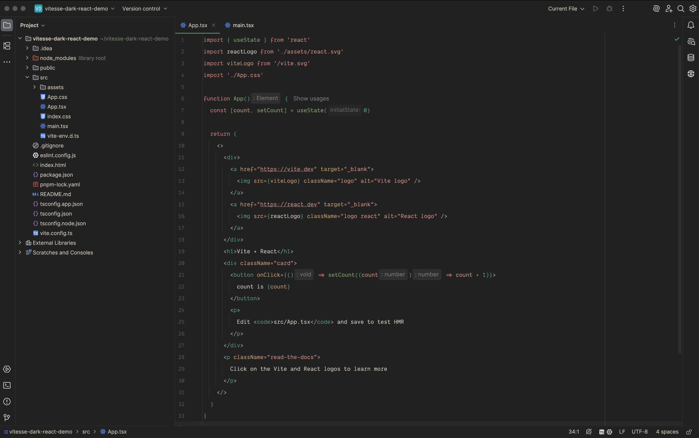

# 🏕️ Vitesse Dark Theme for JetBrains IDEs

**Code in peace. Stay in flow.**  
A calm and minimal dark theme for focused developers.

---

## 🎨 Overview

**Vitesse Dark Theme** is a JetBrains-native interpretation of the beloved [Vitesse palette](https://github.com/antfu/vitesse) — refined for developers who value visual calm, balance, and focus.

### ✨ Why You'll Love It

- 🪵 Deep charcoal background (`#222222`) to reduce noise
- 🔦 Soft green highlights and warm accent tones
- 🧭 Subtle visual cues for navigation and selection
- 🌲 Seamless integration with JetBrains UI

---

## 🖼️ Preview

---

## 🔤 Perfect Font Matches

Works beautifully with:

- [Dank Mono](https://dank.sh/)
- [Fira Code](https://github.com/tonsky/FiraCode)
- [CaskaydiaCove Nerd Font](https://github.com/ryanoasis/nerd-fonts/tree/master/patched-fonts/CascadiaCode)

---

## 🚀 Installation

1. Open any JetBrains IDE
2. Go to `Settings → Plugins → Marketplace`
3. Search for `vitesse-dark-theme`
4. Click **Install**, restart your IDE
5. Apply the theme via `Settings → Appearance & Behavior → Appearance`

---

## 🤍 Credits

- Inspired by [Vitesse](https://github.com/antfu/vitesse) by [@antfu](https://github.com/antfu)
- Created by [@franmc01](https://github.com/franmc01)
- Built on top of the [JetBrains Plugin Template](https://github.com/JetBrains/intellij-platform-plugin-template)

---

## 🪪 License

MIT © 2025 [franmc01](https://github.com/franmc01)

---

  <code>Breathe. Focus. Build. 🏕️</code>

